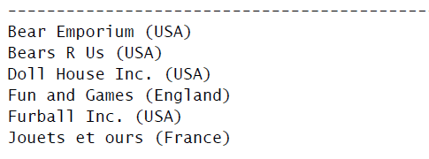

# 02 Character

## Field

字段（field） 基本上与列（column）的意思相同，经常互换使用，不过数据库列一 般称为列，而字段这个术语通常在计算字段这种场合下使用。

### Splice Field

拼接（**concatenate**） 将值联结到一起（将一个值附加到另一个值）构成单个值。

* 在SQL 中的SELECT 语句中，可使用一 个特殊的操作符来拼接两个列。根据你所使用的DBMS，此操作符可用 加号（+）或两个竖杠（||）表示。
* SQL Server 使用+号。
* DB2、Oracle、PostgreSQL 和SQLite 使用||。
* 在MySQL 和MariaDB 中，必须使用 特殊的函数Concat。

```
SELECT vend_name + '(' + vend_country + ')'
FROM Vendors
ORDER BY vend_name;

SELECT vend_name || '(' || vend_country || ')'
FROM Vendors
ORDER BY vend_name;

SELECT Concat(vend_name, ' (', vend_country, ')')
FROM Vendors
ORDER BY vend_name;
```



* 为正确返回格式化的数据，必须去掉空格。这可以使用SQL 的RTRIM()函数来完成，

```
SELECT RTRIM(vend_name) + ' (' + RTRIM(vend_country) + ')'
FROM Vendors
ORDER BY vend_name;
```

