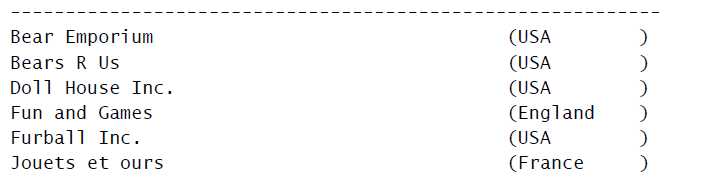

# 01 Introduction SQL

## SQL

SQL是Structured Query Language（结构 化查询语言）的缩写。SQL 是一种专门用来与数据库沟通的语言

### SQL queries <a href="#sql_queries" id="sql_queries"></a>

SQL queries are the most common and essential SQL operations. Via an SQL query, one can search the database for the information needed. SQL queries are executed with the “SELECT” statement. An SQL query can be more specific, with the help of several clauses:

* FROM - it indicates the table where the search will be made.
* WHERE - it's used to define the rows, in which the search will be carried. All rows, for which the WHERE clause is not true, will be excluded.
* ORDER BY - this is the only way to sort the results in SQL. Otherwise, they will be returned in a random order.

```
SELECT * FROM
WHERE active
ORDER BY LastName, FirstName
```

### SQL data manipulation <a href="#sql_data_manipulation" id="sql_data_manipulation"></a>

Data manipulation is essential for SQL tables - it allows you to modify an already created table with new information, update the already existing values or delete them.

With the INSERT statement, you can add new rows to an already existing table. New rows can contain information from the start, or can be with a NULL value.

```
INSERT INTO phonebook(phone, firstname, lastname, address) VALUES('+1 123 456 7890', 'John', 'Doe', 'North America');
```

With the UPDATE statement, you can easily modify the already existing information in an SQL table.


```
UPDATE phonebook SET address = 'North America', phone = '+1 123 456 7890' WHERE firstname = 'John' AND lastname = 'Doe';
```

With the DELETE statement you can remove unneeded rows from a table.

```
DELETE FROM phonebook WHERE WHERE firstname = 'John' AND lastname = 'Doe';
```

****

## Retrieve data

### Select Data

* 多条SQL 语句必须以分号（；）分隔。多数DBMS 不需要在单条SQL 语句后加分号，但也有DBMS 可能必须在单条SQL 语句后加上分号
* SQL 语句不区分大小写，因此SELECT 与select 是相同的
* 在处理SQL 语句时，其中所有空格都被忽略。SQL 语句可以写成长长 的一行，也可以分写在多行
* 在选择多个列时，一定要在列名之间加上逗号，但最后一个列名后不 加
* **检索所有列**: SELECT 语句还可以检 索所有的列而不必逐个列出它们。在实际列名的位置使用星号（\*）通配 符可以做到这点，SELECT \* FROM Products
* **检索不同的值,** 使用DISTINCT 关键字, SELECT DISTINCT vend\_id FROM Products;
* **限制结果**: 可以用TOP 关键字来限制最多返回多 少行，SELECT TOP 5 prod\_name FROM Products;
  * 如果你使用的是DB2，就得使用下面这样的DB2 特有的SQL 语句：SELECT prod\_name FROM Products FETCH FIRST 5 ROWS ONLY;
  * 如果你使用Oracle，需要基于ROWNUM（行计数器）来计算行，SELECT prod\_name FROM Products WHERE ROWNUM <=5;
  * 如果你使用MySQL、MariaDB、PostgreSQL 或者SQLite，需要使用LIMIT 子句，
    * SELECT prod\_name FROM Products LIMIT 5;&#x20;
    * LIMIT 5 OFFSET 5 指示MySQL 等DBMS 返回从第5 行起的5 行数据。
    * 注意：第0 行 第一个被检索的行是第0 行，而不是第1 行。因此，LIMIT 1 OFFSET 1 会检索第2 行，而不是第1 行。
* 很多DBMS 都支持各种形式的注释语法
  * 注释使用-- （两个连字符）嵌在行内。-- 之后的文本就是注释，
  * 另一种形式的行内注释（但这种形式有些DBMS 不支持) ##

### Sort Data

* 在指定一条ORDER BY 子句时，应该保证它是SELECT 语句中最后一 条子句。如果它不是最后的子句
* 要按多个列排序，只须指定这些列名，列名之间用逗号分开即可 SELECT prod\_id, prod\_price, prod\_name FROM Products ORDER BY prod\_price, prod\_name;
* RDER BY 还支持按相对列位置进行排序。SELECT prod\_id, prod\_price, prod\_name FROM Products ORDER BY 2, 3;
* 数据排序不限于升序排序（从A 到Z），这只是默认的排序顺序。还可以 使用ORDER BY 子句进行降序（从Z 到A）排序。为了进行降序排序， 必须指定DESC 关键字。 SELECT prod\_id, prod\_price, prod\_name FROM Products ORDER BY prod\_price DESC;

### Filter Data

* 检索所需数据需要指 定搜索条件（search criteria），搜索条件也称为过滤条件（filter condition. 在SELECT 语句中，数据根据WHERE 子句中指定的搜索条件进行过滤。 WHERE 子句在表名（FROM 子句）之后给出 SELECT prod\_name, prod\_price FROM Products WHERE prod\_price = 3.49;
* 在同时使用ORDER BY 和WHERE 子句时，应该让ORDER BY 位于 WHERE 之后，否则将会产生错误



* NULL 无值（no value），它与字段包含0、空字符串或仅仅包含空格不同。SELECT prod\_name FROM Products WHERE prod\_price IS NULL; 这条语句返回所有没有价格（空prod\_price 字段，不是价格为0）的 产品，由于表中没有这样的行，所以没有返回数据。
* WHERE 子句可以包含任意数目的AND 和OR 操作符。允许两者结合以进 行复杂、高级的过滤
* SQL（像 多数语言一样）在处理OR 操作符前，优先处理AND 操作符。当SQL 看到 上述WHERE 子句时，它理解为：由供应商BRS01 制造的价格为10 美元以 上的所有产品，以及由供应商DLL01 制造的所有产品，而不管其价格如何。 换句话说，由于AND 在求值过程中优先级更高，操作符被错误地组合了。此问题的解决方法是使用圆括号对操作符进行明确分组。圆括号具有比AND 或OR 操作符更高的优先级，所以DBMS 首先 过滤圆括号内的OR 条件

```
SELECT prod_name, prod_price
FROM Products
WHERE (vend_id = 'DLL01' OR vend_id = 'BRS01')
AND prod_price >= 10;
```

* IN 操作符用来指定条件范围，范围中的每个条件都可以进行匹配。IN 取 一组由逗号分隔、括在圆括号中的合法值。 SELECT prod\_name, prod\_price FROM Products WHERE vend\_id IN ('DLL01','BRS01') ORDER BY prod\_name;
* NOT 操作符有且只有一个功能，那就是否定其后所跟的 任何条件。因为NOT 从不单独使用（它总是与其他操作符一起使用），所 以它的语法与其他操作符有所不同。**NOT 关键字可以用在要过滤的列前**， 而不仅是在其后。

```
SELECT prod_name
FROM Products
WHERE NOT vend_id = 'DLL01'
ORDER BY prod_name;
```


### Filter Data using **wildcard**

通配符（**wildcard**） 用来匹配值的一部分的特殊字符。搜索模式（search pattern） 由字面值、通配符或两者组合构成的搜索条件. 为在搜索子句中使用通配符，必须使用LIKE 操作符。LIKE 指示DBMS，后跟的搜索模式利用通配符匹配而不是简单的相等匹配进 行比较。

#### 百分号（%）通配符

* 最常使用的通配符是百分号（%）。在搜索串中，%表示任何字符出现任意次 数。例如，为了找出所有以词Fish 起头的产品，可写以下的SELECT 语句：SELECT prod\_id, prod\_name FROM Products WHERE prod\_name LIKE 'Fish%';
* 根据DBMS 的不同及其配置，搜索可以是区分大小写的
* 通配符可在搜索模式中的任意位置使用，并且可以使用多个通配符。SELECT prod\_id, prod\_name FROM Products WHERE prod\_name LIKE '%bean bag%';
* 提示：根据部分信息搜索电子邮件地址 有一种情况下把通配符放在搜索模式中间是很有用的，就是根据邮件 地址的一部分来查找电子邮件， 例如WHERE email LIKE 'b%@forta.com'。
* 子句WHERE prod\_name LIKE 'F%y'只匹配以F 开头、以y 结尾的prod\_name。如果值后面跟空格， 则不是以y 结尾，所以Fish bean bag toy 就不会检索出来。简单 的解决办法是给搜索模式再增加一个%号：'F%y%'还匹配y 之后的字 符（或空格）。更好的解决办法是用函数去掉空格。

#### 下划线（\_）通配符

* 另一个有用的通配符是下划线（\_）。下划线的用途与%一样，但它只匹配 单个字符，而不是多个字符。
* 与%能匹配多个字符不同，\_总是刚好匹配一个字符，不能多也不能少。SELECT prod\_id, prod\_name FROM Products WHERE prod\_name LIKE '\_\_ inch teddy bear';
* DB2 不支持通配符\_。

#### 方括号（\[ ]）通配符

* 方括号（\[]）通配符用来指定一个字符集，它必须匹配指定位置（通配 符的位置）的一个字符。
* 例如，找出所有名字以J 或M 起头的联系人，可进行如下查询：SELECT cust\_contact FROM Customers WHERE cust\_contact LIKE '\[JM]%' ORDER BY cust\_contact;
* 与前面描述的通配符不一样，并不是所有DBMS 都支持用来创建集合 的\[]。微软的SQL Server 支持集合，但是MySQL，Oracle，DB2，SQLite 都不支持

